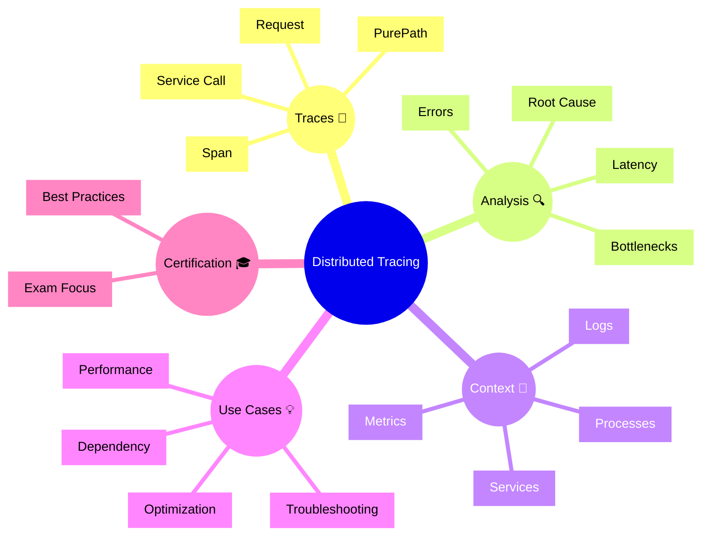

# Dynatrace Distributed Tracing Flashcards

## Flashcards for DynaTrace Associate Certification

### Dynatrace Distributed Tracing Mindmap

### Q: What is distributed tracing in Dynatrace? 🌐
A: The tracing of requests across services and components to show the full execution path and performance of transactions.

### Q: What is a PurePath? 🧵
A: A complete distributed trace showing every hop, service call, and timing for a single request.

### Q: Why is tracing useful for certification? 🎯
A: It demonstrates how Dynatrace pinpoints latency and failures across distributed applications.

### Q: What does a span represent? 📦
A: A single operation or segment within a distributed trace.

### Q: What is root cause analysis in tracing? 🔍
A: Identifying the service or operation responsible for a failure or performance issue.

### Q: How do traces link to services and problems? 🔗
A: They connect requests to service instances and show which errors create problems.

### Q: What is a common tracing use case? 🧰
A: Finding slow database calls or external service calls that delay transactions.

### Q: What should you remember about request latency? ⏱️
A: Tracing breaks down latency by segment so you can see exactly where time is spent.

### Q: What is a best practice for tracing? ✅
A: Use traces to verify whether slow requests are caused by service code, infrastructure, or external dependencies.

### Q: What exam concept is key for tracing? 📘
A: Know that Dynatrace automatically captures distributed traces and uses them to analyze end-to-end user requests.
