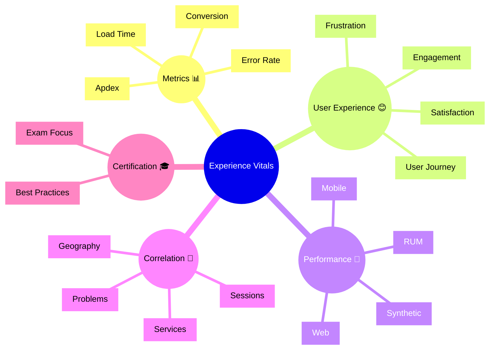

# Dynatrace Experience Vitals Flashcards

## Flashcards for DynaTrace Associate Certification

### Dynatrace Experience Vitals Mindmap

### Q: What are Experience Vitals? ❤️
A: Core user experience metrics like Apdex, load time, error rate, and conversion that show how real users feel about an application.

### Q: Why are Experience Vitals important for certification? 🎓
A: They connect user experience monitoring to business impact and show how Dynatrace evaluates digital experience.

### Q: What does Apdex measure? 📏
A: User satisfaction based on response time thresholds and the ratio of happy to unhappy user actions.

### Q: What is frustration analysis? 😠
A: A technique to detect poor user experiences by looking for slow actions, errors, or dead clicks.

### Q: What data sources feed Experience Vitals? 🔌
A: Real User Monitoring (RUM), synthetic tests, browser/mobile metrics, and session data.

### Q: How does Experience Vitals relate to problems? 🚨
A: It helps prioritize issues by showing which errors and slowdowns actually affect users.

### Q: What is a good exam takeaway for Experience Vitals? 🧠
A: Know that it tracks user-centric health, not just raw infrastructure metrics.

### Q: What does conversion rate indicate? 💰
A: The percentage of user journeys that complete a desired action, such as checkout or signup.

### Q: Why is geographic analysis useful in Experience Vitals? 🌍
A: It shows where users are experiencing slow or failing sessions, helping isolate regional issues.

### Q: What should you watch for in experience health? 👀
A: High frustration, low satisfaction, slow load times, and frequent errors that impact user journeys.
