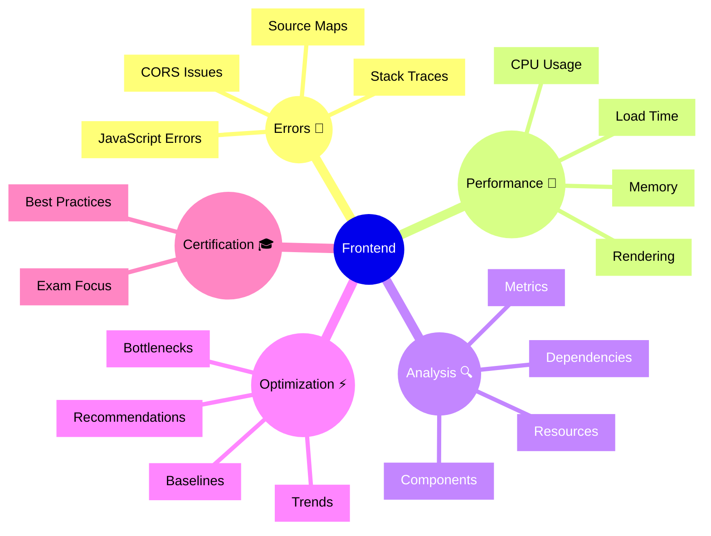

# Dynatrace Frontend Flashcards

## Flashcards for DynaTrace Associate Certification

### Frontend Mindmap

### Q: What does Frontend app focus on? 🔬
A: JavaScript execution, errors, and client-side performance optimization.

### Q: Why are source maps important? 🗺️
A: They map minified code to original source for better error diagnostics.

### Q: What is a JavaScript error? 🚨
A: A runtime error in client-side code that may impact user experience.

### Q: What does rendering performance measure? 🎨
A: The efficiency of DOM manipulation and painting operations.

### Q: How does Frontend app help with optimization? ⚡
A: It identifies slow functions and CPU-intensive operations for targeted improvement.

### Q: What is memory profiling in frontend? 💾
A: Tracking memory allocation and identifying memory leaks.

### Q: How do resource timings help? ⏱️
A: They show how long scripts, styles, and other resources take to load and execute.

### Q: What are Core Web Vitals? 🧭
A: LCP, CLS, and INP are browser metrics that measure loading speed, visual stability, and interaction responsiveness.

### Q: How does the Frontend app help with Core Web Vitals? 🔍
A: It uses front-end performance and rendering data to highlight issues that affect LCP, CLS, and INP.

### Q: What exam point matters? 📘
A: Know that frontend performance directly impacts user satisfaction and SLOs.

### Q: How does frontend correlate with services? 🔗
A: Frontend errors can be linked to slow backend services or API failures.

### Q: What is a best practice for frontend? ✅
A: Deploy source maps and monitor JavaScript errors as a primary health indicator.
