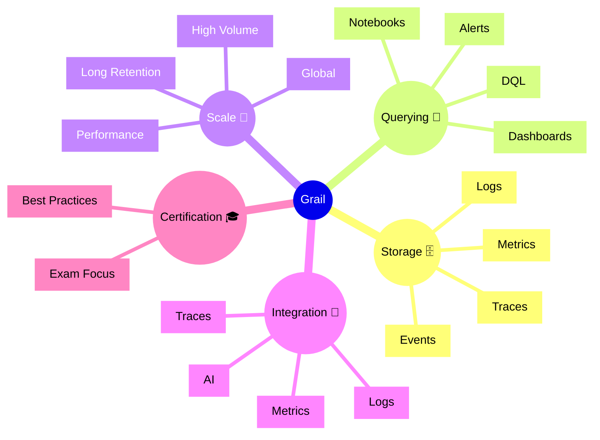

# Dynatrace Grail Flashcards

## Flashcards for DynaTrace Associate Certification

### Dynatrace Grail Mindmap

### Q: What is Dynatrace Grail? 🌐
A: A unified, high-scale observability store for metrics, logs, traces, and events in Dynatrace.

### Q: Why is Grail important for the Associate exam? 🎓
A: It shows how Dynatrace handles large observability volumes and enables advanced queries across data types.

### Q: What kind of data does Grail store? 📦
A: Metrics, logs, traces, events, and other telemetry with long retention and high performance.

### Q: How does Grail support DQL? 🧠
A: Grail is the backend that powers DQL queries and stores the queried observability data.

### Q: What is a key benefit of unified storage? 🔄
A: It allows seamless correlation between metrics, logs, traces, and events.

### Q: What does "scale" mean in Grail? 📈
A: The ability to ingest and retain huge volumes of observability data without losing query speed.

### Q: How is Grail used in dashboards and alerts? 🛎️
A: Query results from Grail can be embedded into dashboards and trigger alerts.

### Q: What is an exam-relevant concept? 🧠
A: Understand that Grail provides the data foundation for advanced analytics and AI-driven insights.

### Q: What should you remember about retention? 🕒
A: Grail enables long-term storage of telemetry, letting teams analyze historical behavior.

### Q: What is a best practice for Grail use? ✅
A: Use it for cross-data correlation, complex queries, and long-term observability retention.
