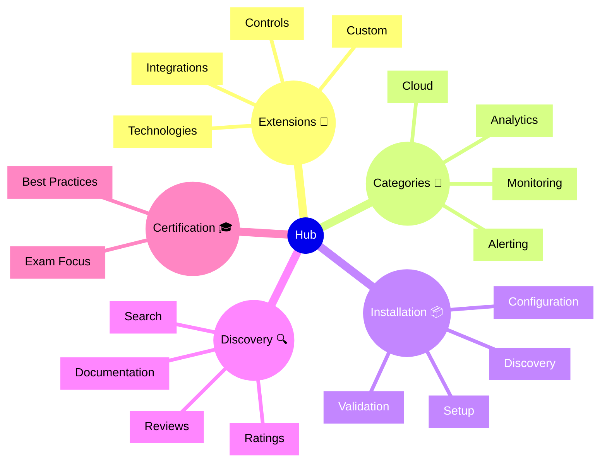

# Dynatrace Hub Flashcards

## Flashcards for DynaTrace Associate Certification

### Hub Mindmap

### Q: What is the Dynatrace Hub? 🛒
A: A marketplace for extensions, integrations, and community content.

### Q: Why is Hub relevant for certification? 🎓
A: It shows how Dynatrace can be extended and integrated with other tools.

### Q: What is an ActiveGate extension? 🔌
A: A custom monitoring plugin that runs on ActiveGate to monitor specific systems.

### Q: What is a problem notification extension? 🔔
A: An outbound integration that sends Dynatrace alerts to external systems like Slack.

### Q: What types of integrations are available? 🔄
A: Cloud providers, monitoring tools, alerting systems, and custom API integrations.

### Q: How do you find extensions? 🔍
A: Search by technology, category, or use case in the Hub marketplace.

### Q: What information is available for extensions? 📖
A: Documentation, installation guides, ratings, reviews, and support resources.

### Q: What exam point matters? 📘
A: Know that Hub enables extending Dynatrace beyond core capabilities.

### Q: How are custom metrics ingested? 📊
A: Via OneAgent extensions or Dynatrace APIs.

### Q: What is a best practice for Hub? ✅
A: Review documentation and test extensions in non-production before deploying.
