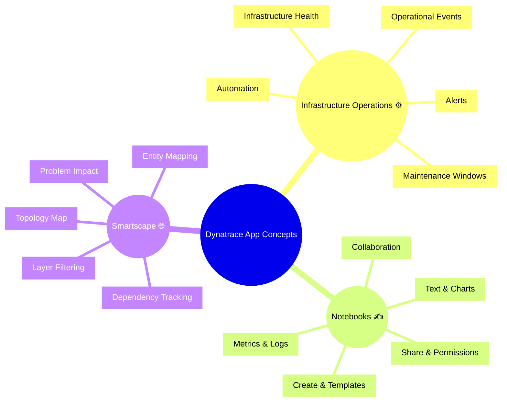
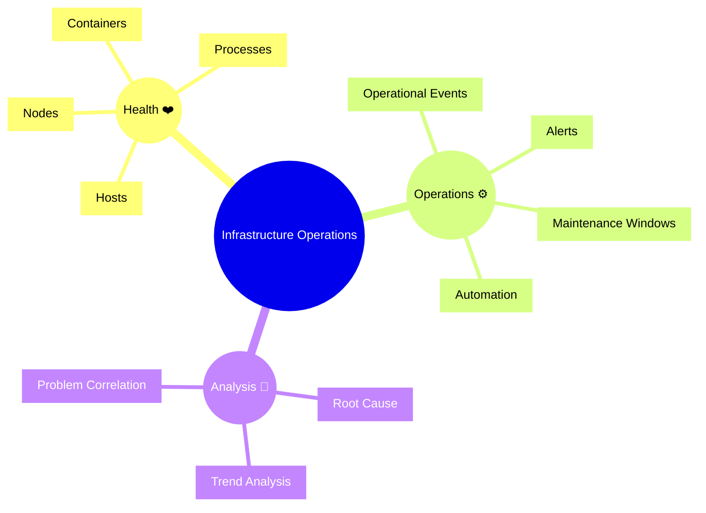
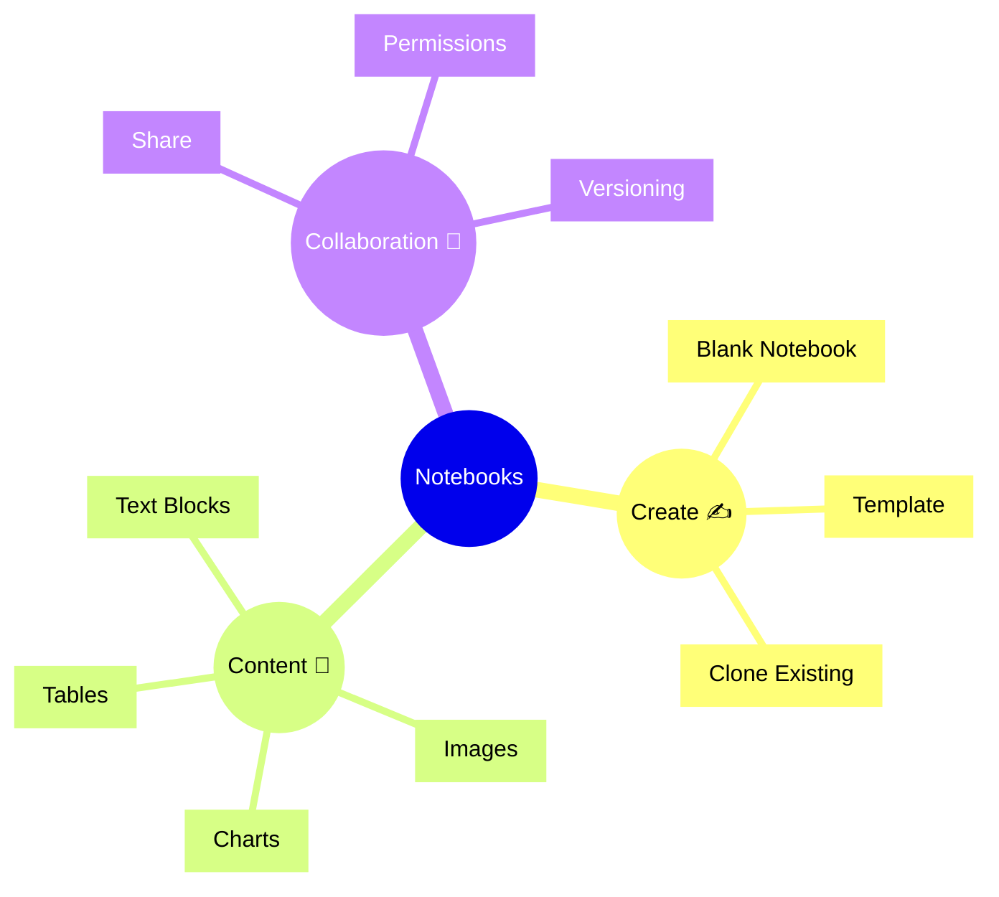
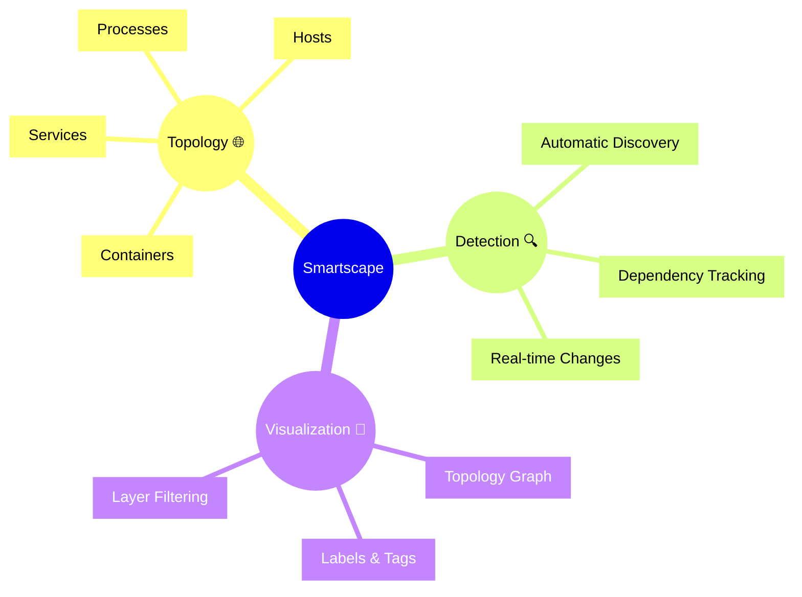

# Dynatrace Infrastructure Operations, Notebooks, and Smartscape Flashcards

## Overview

These flashcards cover key concepts from the attached Dynatrace Infrastructure Operations, Notebooks, and Smartscape app docs. They are designed for DynaTrace Associate certification review and include Mermaid diagrams plus iconic descriptions.

## Combined Mindmap

## Infrastructure Operations Flashcards

### Q: What is the Dynatrace Infrastructure Operations app? 🧭
A: A centralized view of infrastructure health, performance, and operational events that helps connect infrastructure state to service and application behavior.

### Q: What is an operational event? 📅
A: A record of configuration changes, alerts, or system activity that affects infrastructure operations.

### Q: What is a maintenance window? 🛠️
A: A scheduled period for planned work where alerts and operational impact may be managed differently.

### Q: Why is automation useful in infrastructure operations? 🤖
A: Automation helps operational teams respond faster by applying policies, alerts, or workflow actions automatically.

### Q: What should Associate candidates remember about event correlation? 🔗
A: It links infrastructure events to affected entities and problems so operators can understand incident impact and root cause.

### Q: What is a key sign of infrastructure degradation? ⚠️
A: Trending CPU, memory, disk, network, or latency issues over time that can indicate slow-moving outages.

## Infrastructure Operations Diagram

## Notebooks Flashcards

### Q: What is the Dynatrace Notebooks app? 📘
A: A collaborative documentation tool for capturing investigations, sharing insights, and combining charts, text, and Dynatrace data in one place.

### Q: What is a notebook template? 📄
A: A prebuilt notebook layout used to standardize investigation workflows and make repeatable reporting easier.

### Q: How do notebooks support certification study? 🎓
A: By letting you document troubleshooting steps, capture root cause analysis, and reuse structured notes for exam review.

### Q: What is a data block in notebooks? 🧩
A: A visual block that pulls in Dynatrace metrics, problems, logs, traces, or entities for real-time analysis.

### Q: Why are sharing and permissions important in notebooks? 👥
A: They enable team collaboration, review, and controlled access to investigation notes and findings.

## Notebooks Diagram

## Smartscape Flashcards

### Q: What is Dynatrace Smartscape? 🌐
A: A real-time topology map that shows the relationships and dependencies between services, processes, hosts, containers, and cloud resources.

### Q: What is an entity in Smartscape? 🧠
A: Any monitored object, such as a service, process, host, container, or cloud component.

### Q: How do dependencies help in Smartscape? 🔗
A: Dependencies show which components communicate and rely on each other, making it easier to identify impact paths.

### Q: What does layer filtering do? 🧭
A: It isolates specific entity layers like services, hosts, or containers for focused analysis.

### Q: Why is Smartscape useful for incident analysis? 🚨
A: It provides a topology view that links problems and impact to the underlying entity relationships.

## Smartscape Diagram

## Study Tips

- Use the Infrastructure Operations flashcards to connect operational events with infrastructure health.
- Use the Notebooks flashcards to capture and share investigation workflows.
- Use the Smartscape flashcards to trace impact through topology and dependencies.
- Review the diagrams to remember how each app fits into the Dynatrace Associate certification domain.
