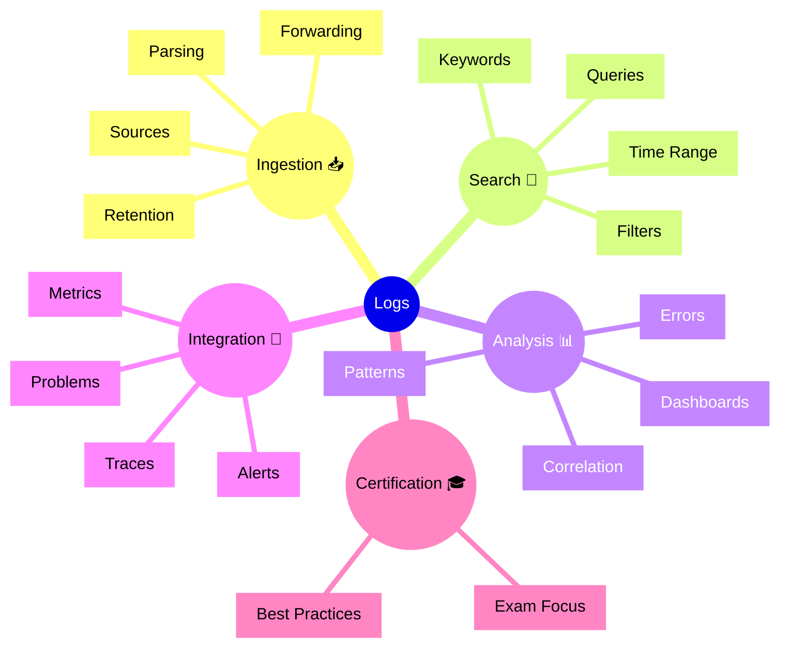

# Dynatrace Logs Flashcards

## Flashcards for DynaTrace Associate Certification

### Dynatrace Logs Mindmap

### Q: What does the Logs app do? 📚
A: It collects, searches, and analyzes logs from applications and infrastructure to help troubleshoot issues.

### Q: Why are logs important for certification? 🎓
A: Logs provide detailed event context that complements metrics and traces for root cause analysis.

### Q: What is DQL used for in Logs? 🧠
A: To query log data, filter events, and create custom visualizations or alerts.

### Q: What is log ingestion? 📥
A: The process of collecting logs from sources and storing them for analysis.

### Q: How do log filters help? 🧹
A: They narrow down search results to specific messages, entities, or time ranges.

### Q: What is log correlation? 🔗
A: Linking log events to services, traces, or problems to understand issue context.

### Q: What does parsing do? 🛠️
A: Extracts structured fields from log lines to make them searchable and analyzable.

### Q: What is a best practice for using logs? ✅
A: Use structured log queries and correlation with traces to pinpoint the exact cause of failures.

### Q: What should Associate candidates remember about log retention? 🕒
A: Retention determines how far back you can search logs for incident investigation.

### Q: What advantage does log search provide? 🔍
A: It allows quick diagnosis of errors, exceptions, and unusual events that metrics alone may not reveal.
