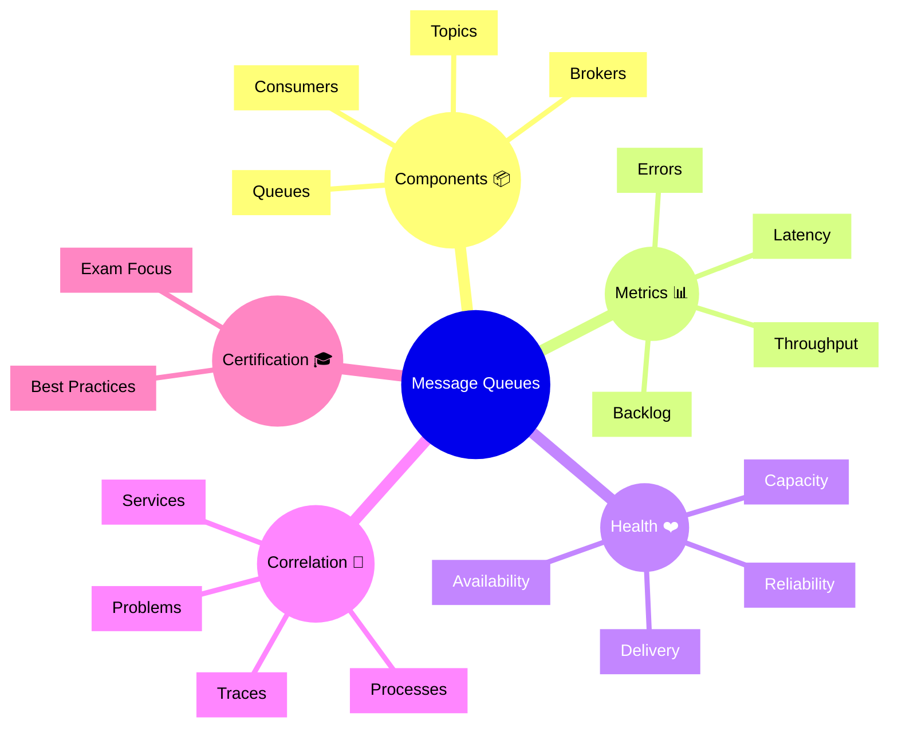

# Dynatrace Message Queues Flashcards

## Flashcards for DynaTrace Associate Certification

### Dynatrace Message Queues Mindmap

### Q: What is the Message Queues app used for? 📬
A: Monitoring the health and performance of messaging systems, including queues, brokers, topics, and consumers.

### Q: Why is Message Queues relevant for certification? 🎓
A: It shows how Dynatrace extends observability to asynchronous communication and message-driven architectures.

### Q: What is queue backlog? 📥
A: The number of messages waiting in a queue that have not yet been processed.

### Q: What does message latency measure? ⏱️
A: The time it takes for a message to travel from producer to consumer.

### Q: How does Dynatrace correlate message queue issues? 🔗
A: It links queue metrics to related services, traces, and problem events.

### Q: What is a broker in the Message Queues context? 🧠
A: The messaging server that manages queues and routes messages between producers and consumers.

### Q: What should Associate candidates know about message queue health? ❤️
A: Look for high backlog, slow consumer throughput, and repeated delivery failures.

### Q: What is the benefit of queue monitoring? 📈
A: It helps detect asynchronous bottlenecks before they affect application performance.

### Q: What is an exam best practice for this topic? ✅
A: Understand how message queue metrics reflect reliability and how they impact service behavior.

### Q: What is a common issue in messaging systems? ⚠️
A: Stalled queues, slow consumers, or broker overload causing delivery delays and errors.
