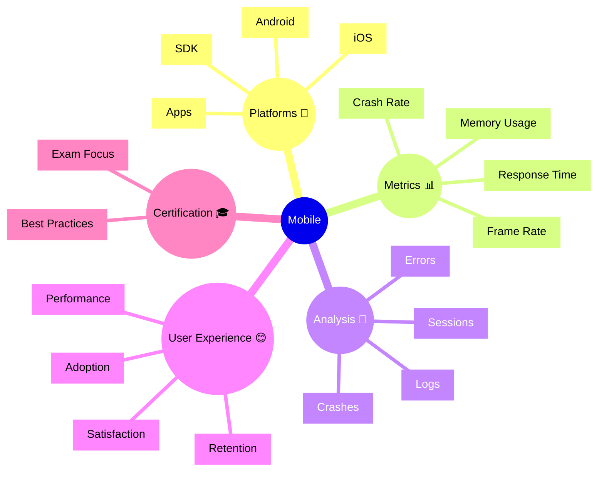

# Dynatrace Mobile Flashcards

## Flashcards for DynaTrace Associate Certification

### Mobile Mindmap

### Q: What does Dynatrace Mobile monitoring provide? 📱
A: Comprehensive performance and crash monitoring for iOS and Android applications.

### Q: Why is mobile monitoring relevant for certification? 🎓
A: It shows how Dynatrace extends observability to mobile platforms and user experience.

### Q: What is the crash rate metric? 💥
A: The percentage of user sessions that end with an application crash.

### Q: What is frame rate in mobile context? 🎬
A: The smoothness of UI rendering, measured in frames per second.

### Q: How does the Mobile SDK work? 🔧
A: It automatically instruments iOS and Android apps to capture performance and crash data.

### Q: What is session replay in mobile? ▶️
A: The ability to replay user interactions to diagnose crashes and performance issues.

### Q: How does memory profiling help? 🧠
A: It identifies memory leaks and excessive allocations that impact app performance.

### Q: What exam concept matters? 📘
A: Know that mobile monitoring feeds into overall digital experience metrics.

### Q: How do mobile errors correlate with backend? 🔗
A: Mobile crashes can be linked to backend service issues or API problems.

### Q: What is a best practice for mobile? ✅
A: Instrument mobile apps early and monitor crash rates alongside user satisfaction.
