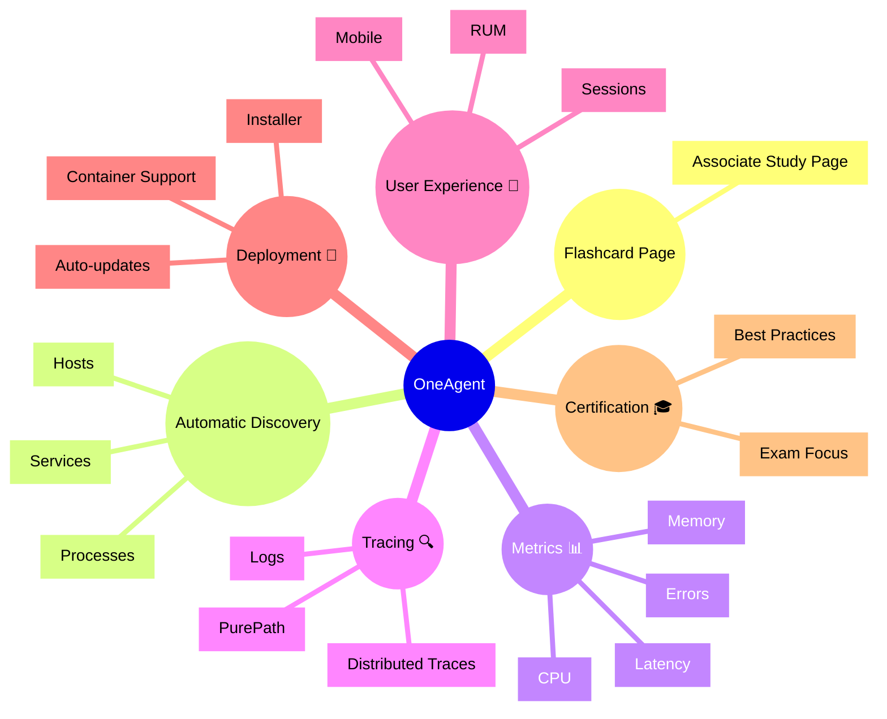

# Dynatrace OneAgent Flashcards

## Flashcards for DynaTrace Associate Certification

### Dynatrace OneAgent Mindmap

### Q: What is OneAgent? 🧩
A: The Dynatrace agent installed on hosts or containers to automatically capture full-stack monitoring data for infrastructure, applications, and user experience.

### Q: Why is OneAgent important for the Associate certification? 🎓
A: It is the foundation of Dynatrace observability, enabling automatic discovery, service detection, metric collection, and trace correlation.

### Q: What does OneAgent automatically discover? 🔎
A: Hosts, processes, containers, services, and application components across supported technologies.

### Q: What is PurePath in OneAgent? 🧵
A: A distributed trace showing the detailed transaction path through services and code that helps identify root causes.

### Q: How does OneAgent support user experience? 👥
A: It collects RUM and mobile metrics when enabled, linking frontend experience to backend performance.

### Q: How is OneAgent deployed? 🚀
A: Via installers, container images, or automatic deployment tools, with support for auto-updates and version management.

### Q: What is an Associate-level best practice for OneAgent? ✅
A: Install OneAgent broadly on supported hosts and containers, and monitor its deployment status and update health.
