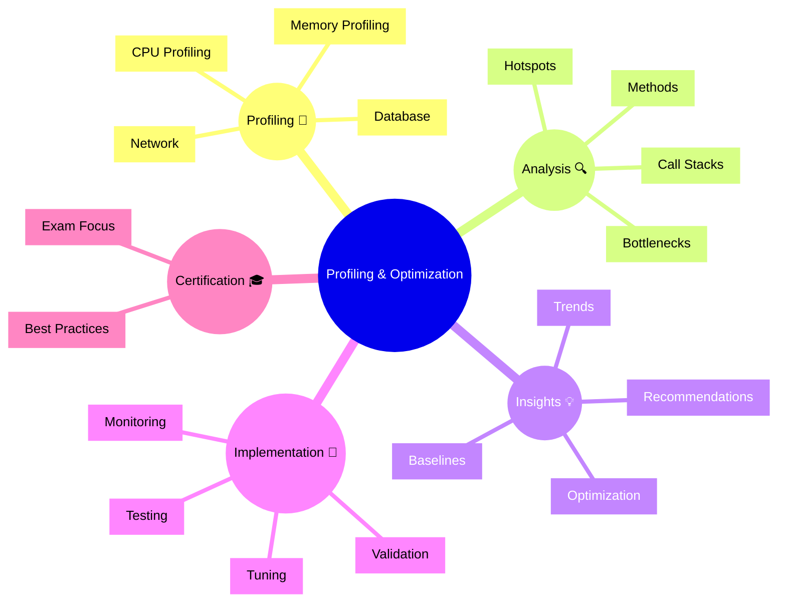

# Dynatrace Profiling & Optimization Flashcards

## Flashcards for DynaTrace Associate Certification

### Profiling & Optimization Mindmap

### Q: What is code profiling? 🔬
A: Analyzing code execution to measure performance and identify optimization opportunities.

### Q: Why is profiling relevant for certification? 🎓
A: It shows how Dynatrace enables code-level performance analysis.

### Q: What is a hotspot? 🔥
A: A code section that consumes a disproportionate amount of resources.

### Q: What does CPU profiling reveal? 💻
A: Which methods consume the most CPU time during execution.

### Q: What is memory profiling? 💾
A: Analyzing memory allocation, usage, and garbage collection.

### Q: How do call stacks help? 📍
A: They show the sequence of methods leading to the current execution point.

### Q: What are optimization recommendations? 💡
A: Specific suggestions from Dynatrace for improving code performance.

### Q: What exam point matters? 📘
A: Know that profiling data guides optimization efforts on high-impact code.

### Q: How do performance baselines help? 📊
A: They allow tracking optimization progress and detecting regressions.

### Q: What is a best practice for profiling? ✅
A: Prioritize optimizations by impact on user-facing performance metrics.
