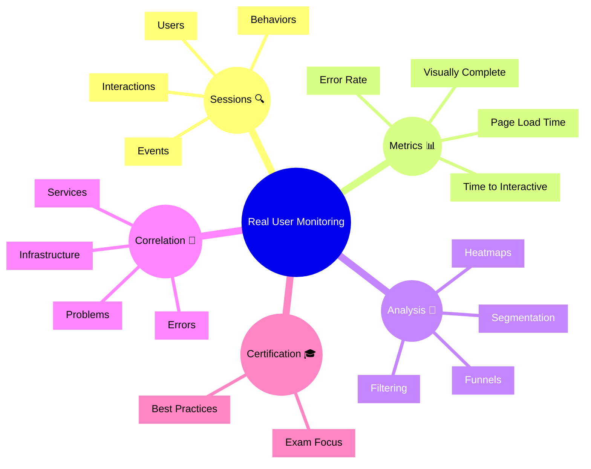

# Dynatrace Real User Monitoring Flashcards

## Flashcards for DynaTrace Associate Certification

### Real User Monitoring Mindmap

### Q: What is Real User Monitoring (RUM)? 👥
A: The capture and analysis of real user interactions with web and mobile applications to measure user experience.

### Q: Why is RUM important for certification? 🎓
A: It demonstrates how Dynatrace monitors actual end-user experience from the client side.

### Q: What is a user session in RUM? 🔍
A: A recorded sequence of user interactions with an application from start to finish.

### Q: What does page load time measure? ⏱️
A: The time it takes for a web page to fully load and become interactive for the user.

### Q: What is visually complete? 👁️
A: The point at which all visual elements on a page have finished rendering.

### Q: How does RUM correlate with backend services? 🔗
A: RUM data is linked to related services and infrastructure to understand end-to-end performance.

### Q: What is funnel analysis in RUM? 🔀
A: Tracking user flows through critical business steps to identify where users drop off.

### Q: What exam concept matters for RUM? 📘
A: Know that RUM captures real user experience as a primary indicator of application health.

### Q: How does segmentation help in RUM? 🧩
A: Filtering users by geography, device, or browser helps identify issues affecting specific groups.

### Q: What is a best practice for RUM monitoring? ✅
A: Use RUM baselines to establish SLOs and user experience targets.
