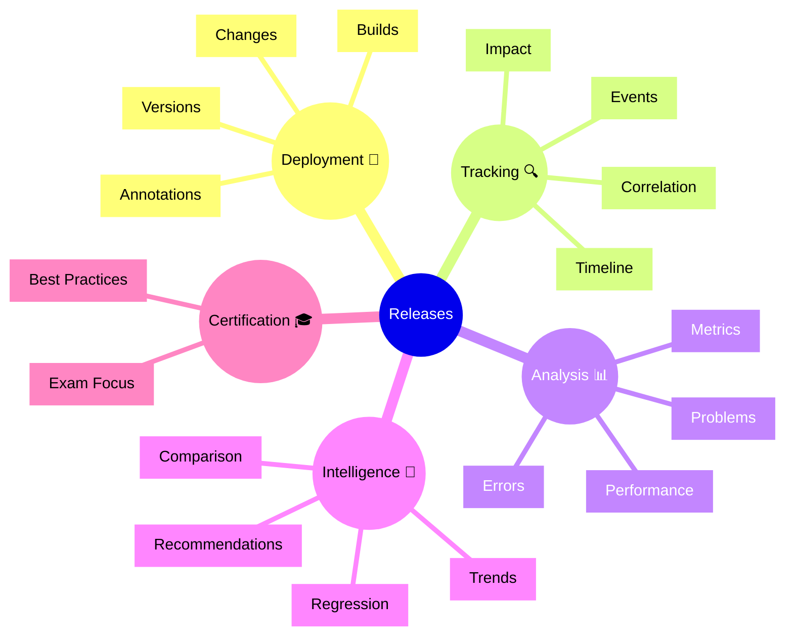

# Dynatrace Releases Flashcards

## Flashcards for DynaTrace Associate Certification

### Releases Mindmap

### Q: What do Releases track in Dynatrace? 🚀
A: Application deployment events and their correlation with performance and problem changes.

### Q: Why are Releases important for certification? 🎓
A: They show how to correlate code changes with observability data.

### Q: What is a release annotation? 🏷️
A: Manual metadata about a deployment that appears on metric timelines.

### Q: How does impact analysis work? 📊
A: Automatically detecting performance changes before and after a release.

### Q: What is regression detection? 🔴
A: Identifying when a release introduces performance problems or errors.

### Q: How do releases integrate with CI/CD? 🔄
A: Automatically capturing deployment events from build and deployment pipelines.

### Q: What is deployment timeline? ⏱️
A: A record of when releases occurred overlaid on performance metric graphs.

### Q: What exam point matters? 📘
A: Know that release data helps detect deployment-related issues quickly.

### Q: How does metric comparison help? 🔍
A: Comparing performance before and after releases shows their impact.

### Q: What is a best practice for releases? ✅
A: Monitor metrics carefully after deployments and establish rollback criteria.
