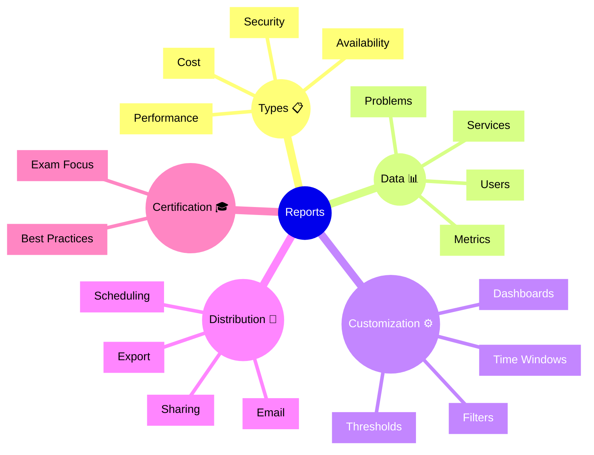

# Dynatrace Reports Flashcards

## Flashcards for DynaTrace Associate Certification

### Reports Mindmap

### Q: What do Dynatrace Reports provide? 📋
A: Scheduled reporting on application and infrastructure performance for stakeholder communication.

### Q: Why are Reports important for certification? 🎓
A: They show how to communicate observability insights to different audiences.

### Q: What types of reports are available? 📊
A: Performance, availability, cost, and security reports.

### Q: What is a performance report? 📈
A: A summary of service and application metrics over a time period.

### Q: What is an availability report? 📅
A: Tracking of uptime and SLO compliance against targets.

### Q: How are reports customized? ⚙️
A: By selecting metrics, filters, time windows, and thresholds.

### Q: What distribution options exist? 📧
A: Email scheduling, direct links, and export to PDF or Excel.

### Q: What exam point matters? 📘
A: Know that reports help communicate compliance and highlight improvement areas.

### Q: How do reports support governance? 🏢
A: They provide audit trails and compliance documentation.

### Q: What is a best practice for reports? ✅
A: Create tailored reports for each stakeholder group with relevant metrics.
