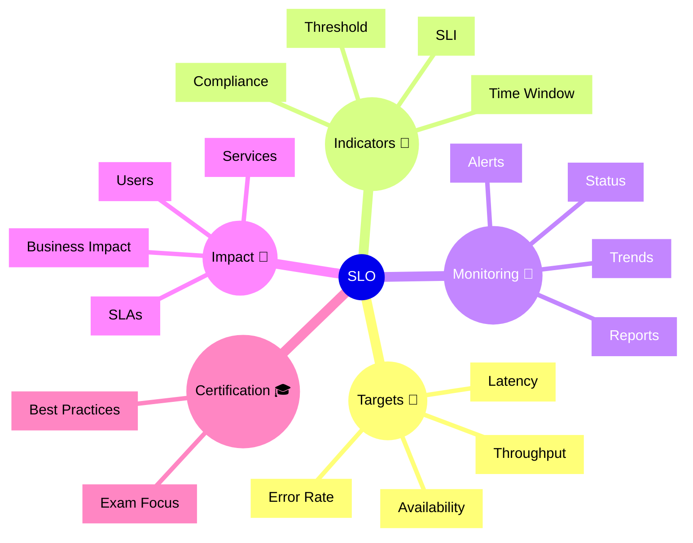

# Dynatrace SLO Flashcards

## Flashcards for DynaTrace Associate Certification

### Dynatrace SLO Mindmap

### Q: What is an SLO? 🧭
A: A Service Level Objective is a performance or reliability target for a service.

### Q: Why are SLOs important for certification? 🎓
A: They show how Dynatrace helps teams measure service reliability against business expectations.

### Q: What is an SLI? 📌
A: A Service Level Indicator is the metric used to judge whether an SLO is being met.

### Q: What does time window mean for SLOs? ⏱️
A: The period over which service performance is evaluated against the target.

### Q: What is a violation? ⚠️
A: When actual service performance falls below the defined SLO target.

### Q: How do SLO alerts work? 🚨
A: Alerts can be generated when SLO compliance is at risk or violated.

### Q: What is a best practice for defining SLOs? ✅
A: Keep objectives realistic and tied to business or user-facing expectations.

### Q: What should Associate candidates understand about SLAs? 📘
A: SLAs are contractual commitments, while SLOs are internal reliability targets.

### Q: What does SLO compliance show? 📊
A: The percentage of time or requests that meet the objective.

### Q: What is the business value of SLOs? 💼
A: They help teams prioritize reliability improvements and justify operational focus.
