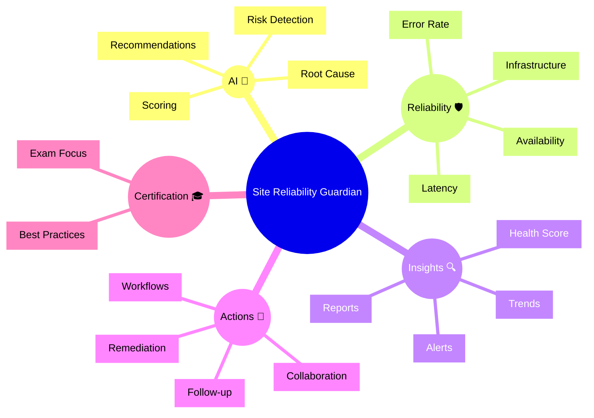

# Dynatrace Site Reliability Guardian Flashcards

## Flashcards for DynaTrace Associate Certification

### Dynatrace Site Reliability Guardian Mindmap

### Q: What is Site Reliability Guardian? 🛡️
A: An AI-powered Dynatrace app that detects reliability risks and recommends remediation actions.

### Q: Why is Guardian important for certification? 🎓
A: It showcases proactive reliability monitoring and AI-driven operational guidance.

### Q: What does reliability risk detection mean? 🔎
A: Identifying conditions that could harm availability, performance, or service stability.

### Q: How does Guardian score issues? 🧠
A: It ranks risks by severity and potential business impact.

### Q: What kinds of recommendations does Guardian provide? 📌
A: Suggested remediation steps, follow-up actions, and workflow integrations.

### Q: What is the difference between reactive problems and Guardian insights? ⚡
A: Problems are detected incidents; Guardian insights are proactive risk signals and recommendations.

### Q: What should Associate candidates remember about Guardian? 📘
A: It is focused on reliability posture and operational readiness, not just individual alerts.

### Q: How does Guardian support collaboration? 🤝
A: It provides a shared view of risks and recommended actions for SRE and operations teams.

### Q: What is a best practice for Guardian use? ✅
A: Review risk findings regularly and track remediation progress.

### Q: What is the main benefit of Guardian? 🌟
A: It helps teams catch reliability issues early and prioritize fixes with business impact.
