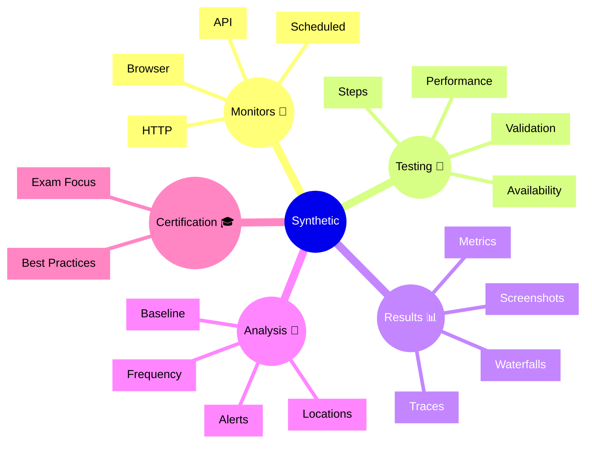

# Dynatrace Synthetic Flashcards

## Flashcards for DynaTrace Associate Certification

### Synthetic Mindmap

### Q: What is synthetic monitoring? 🤖
A: Automated testing of applications through simulated browser or API interactions to detect issues proactively.

### Q: Why is synthetic important for certification? 🎓
A: It shows how Dynatrace detects problems before real users are affected.

### Q: What is a browser monitor? 🌐
A: An automated test that uses a browser to simulate real user workflows.

### Q: What is an API monitor? 📡
A: An automated test that checks API endpoints for availability and performance.

### Q: What is a waterfall chart? 📊
A: A visualization showing the sequence and timing of resource loads in a synthetic test.

### Q: How do geo-locations help in synthetic testing? 🌍
A: Running tests from multiple regions detects regional performance issues.

### Q: What does synthetic baseline reveal? 📈
A: The expected performance level of an application during normal operation.

### Q: What is an exam key point for synthetic? 📘
A: Synthetic tests provide proactive detection and SLO validation.

### Q: How do synthetic results correlate with real users? 👥
A: Comparing synthetic vs. real user metrics validates application performance expectations.

### Q: What is a best practice for synthetic monitoring? ✅
A: Create monitors for critical business workflows and APIs used by real users.
