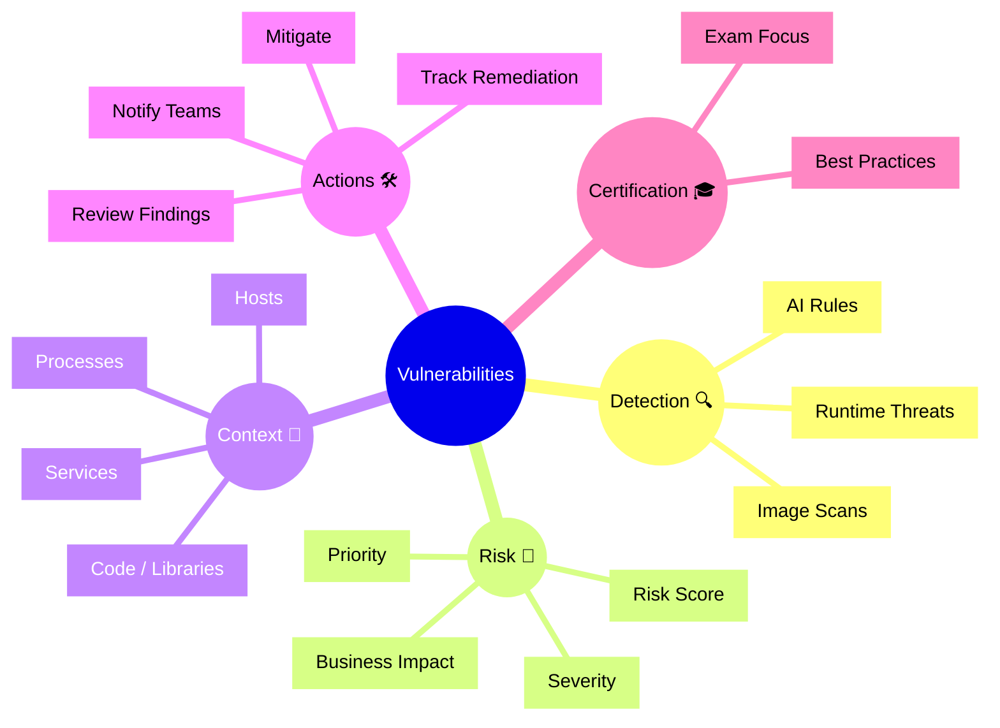

# Dynatrace Vulnerabilities Flashcards

## Flashcards for DynaTrace Associate Certification

### Dynatrace Vulnerabilities Mindmap

### Q: What does the Vulnerabilities app show? 🛡️
A: It shows runtime threats, vulnerable libraries, misconfigurations, and security issues detected across applications and infrastructure.

### Q: Why is Vulnerabilities important for the Associate exam? 🎯
A: It demonstrates how Dynatrace gives security context alongside performance monitoring, which is key for modern observability.

### Q: What is a vulnerability risk score? 🔢
A: A combined severity measurement that helps prioritize remediation of security issues based on potential impact.

### Q: What types of issues can Dynatrace identify in Vulnerabilities? ⚠️
A: Runtime threats, open source library vulnerabilities, configuration weaknesses, and unsafe behavior patterns.

### Q: How are security findings correlated in Dynatrace? 🔗
A: Findings are linked to services, hosts, processes, and code components so you can see where the issue exists.

### Q: What is the benefit of viewing vulnerabilities with service context? 🌐
A: It helps you understand which applications and business services are exposed by a security issue.

### Q: What is the first step after finding a vulnerability? ✅
A: Review the issue details, assess severity, and plan remediation based on impact and affected entities.

### Q: What does "runtime" vulnerability detection mean? 🕒
A: It means Dynatrace monitors live application behavior to detect threats while the application is running.

### Q: How does Dynatrace help with remediation tracking? 📍
A: It lets teams track fixes and verify that the vulnerable component is no longer active or exposed.

### Q: What is a best practice for security flashcards? 🧠
A: Remember that vulnerability insights are part of observability and should be reviewed alongside problems and performance.
