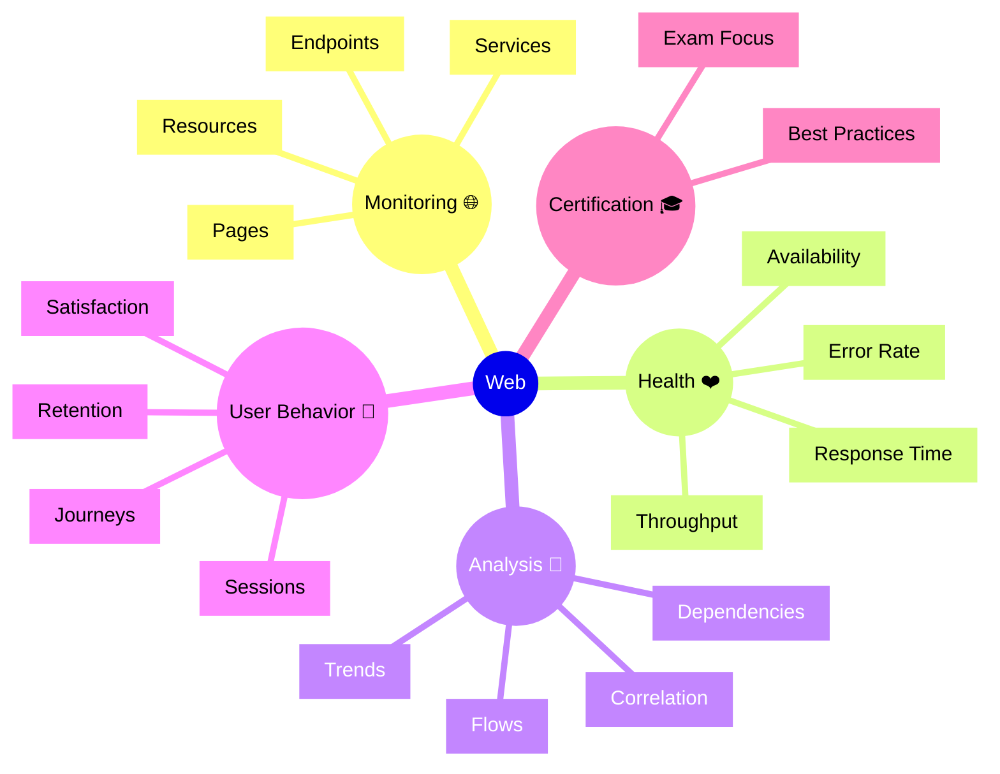

# Dynatrace Web Flashcards

## Flashcards for DynaTrace Associate Certification

### Web Mindmap

### Q: What does the Web app monitor? 🌐
A: Web application pages, endpoints, services, and user sessions.

### Q: Why is Web monitoring important? 🎓
A: It provides comprehensive monitoring across multiple application layers.

### Q: What is endpoint analysis? 🎯
A: Analyzing individual API endpoints and URLs for performance and availability.

### Q: What is a user journey? 🚶
A: The path a user takes through pages and interactions in a web application.

### Q: How does Web app show availability? 📊
A: By tracking successful vs. failed requests and response times.

### Q: What is dependency mapping? 🔗
A: Showing which web pages depend on backend services for functionality.

### Q: How does Web correlate with services? 🔄
A: Linking page performance to underlying service response times and errors.

### Q: What exam concept matters? 📘
A: Know that Web monitoring integrates frontend and backend data.

### Q: What is page-level trending? 📈
A: Tracking performance metrics over time to detect degradation.

### Q: What is a best practice for Web monitoring? ✅
A: Monitor critical pages and correlate web issues with backend services.
