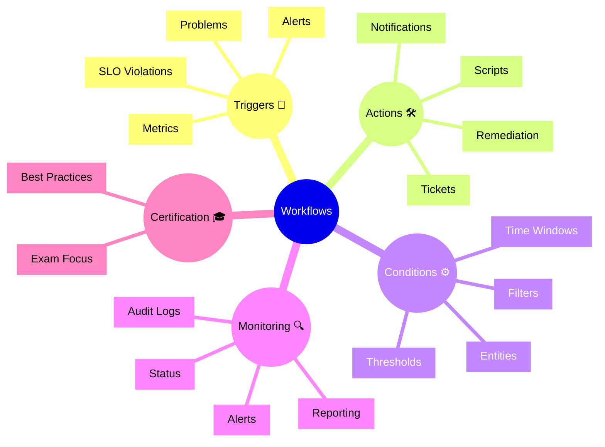

# Dynatrace Workflows Flashcards

## Flashcards for DynaTrace Associate Certification

### Dynatrace Workflows Mindmap

### Q: What is a workflow in Dynatrace? 🔁
A: An automated response process that triggers actions based on alerts, problems, metrics, or SLO violations.

### Q: Why are workflows relevant for certification? 🎓
A: They show how Dynatrace can automate operational response and reduce manual incident handling.

### Q: What are workflow triggers? 🚦
A: Conditions like problems, alerts, metric thresholds, or SLO breaches that start the workflow.

### Q: What actions can workflows perform? 🛠️
A: Send notifications, create tickets, run scripts, or initiate remediation.

### Q: What role do conditions play in workflows? ⚙️
A: They refine when workflows execute using filters, thresholds, time windows, and entity selection.

### Q: What is audit logging in workflows? 📜
A: A record of workflow executions, outcomes, and triggered actions for review.

### Q: What is a best practice for workflows? ✅
A: Keep triggers precise and use audit logs to confirm that automation behaves as expected.

### Q: How do workflows improve operations? ⏱️
A: By responding faster to incidents and ensuring consistent follow-up actions.

### Q: What should Associate candidates remember about safety? 🛡️
A: Workflows should be carefully scoped to avoid unnecessary or noisy automation.

### Q: How do workflows connect to alerts? 🚨
A: They often execute when alert conditions or problem events occur.
