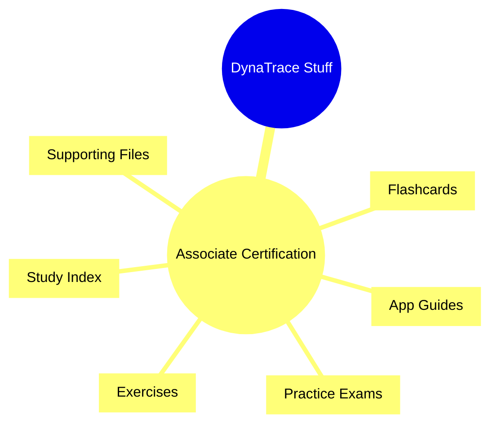

# DynaTrace-Stuff

## Dynatrace Associate Certification Study Hub

A concise index for the `DynaTrace-Associate-Certification` study materials, including app guides, flashcards, practice exams, and lab resources.

## Key Sections

- **Study Index**
  - `DynaTrace-Associate-Certification/DynaTrace-associate-index.md` — central overview of certification topics and resources.
- **App Guides** (`DynaTrace-Associate-Certification/Apps/`)
  - `Dynatrace-Services-App.md` — services, PurePath, service flow, and issue detection.
  - `Dynatrace-Dashboards-App.md` — dashboard creation, tiles, data sources, and reporting.
  - `Dynatrace-Digital-Experience-App.md` — RUM, synthetic monitoring, sessions, and UX metrics.
  - `Dynatrace-Kubernetes-App.md` — Kubernetes clusters, namespaces, pods, workloads, and container metrics.
  - `Dynatrace-Infrastructure-Observability-App.md` — host, process, container, and infrastructure metrics.
  - `Dynatrace-Problems-App.md` — problem detection, prioritization, impact, and root cause.
- **Application Security**
  - `DynaTrace-Application-Security-App.md` — runtime threats, vulnerabilities, risk scoring, and security context.
- **Flashcards** (`DynaTrace-Associate-Certification/flashcards/`)
  - `Dynatrace-Services-Flashcards.md`
  - `Dynatrace-Dashboards-Flashcards.md`
  - `Dynatrace-Digital-Experience-Flashcards.md`
  - `Dynatrace-Kubernetes-Flashcards.md`
  - `Dynatrace-Infrastructure-Observability-Flashcards.md`
  - `Dynatrace-Application-Security-Flashcards.md`
  - `Dynatrace-Problems-Flashcards.md`
- **Practice**
  - `DynaTrace-Associate-Certification/practice-exams.md` — practice questions and exam preparation.
- **Exercise Resources**
  - `DynaTrace-Associate-Certification/Exercises/` — hands-on labs and exercises.
  - `DynaTrace-Associate-Certification/files/` — supporting reference files.

## How to Use

1. Open `DynaTrace-Associate-Certification/DynaTrace-associate-index.md` for the main study roadmap.
2. Read the app guides under `Apps/` for targeted Dynatrace module details.
3. Review flashcards for quick concept recall and certification prep.
4. Complete practice exams and exercises to validate understanding.

## Iconic Guide

- 🔎 `Detection` — learn what Dynatrace finds automatically.
- 📊 `Metrics` — understand the key performance and health signals.
- 🚨 `Problems` — focus on issue detection and root cause.
- 🧠 `Certification` — keep exam-relevant concepts front and center.
